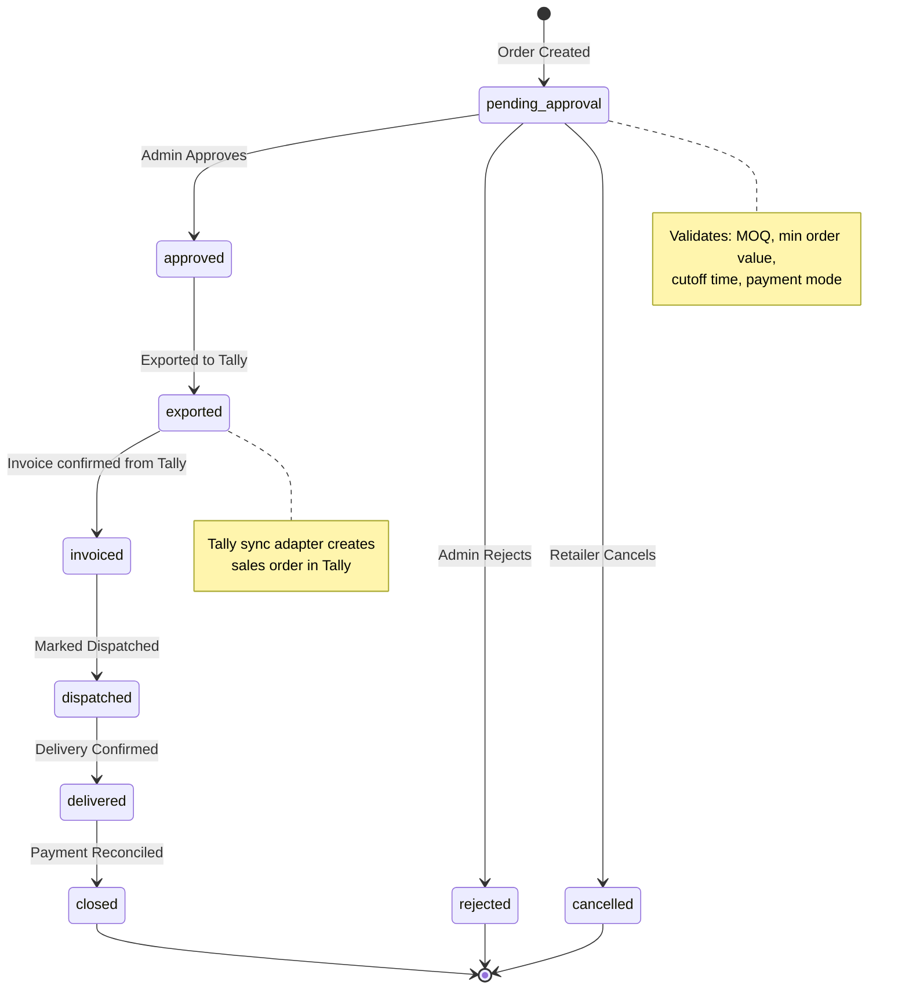

# SupplySetu — Implementation Plan

> **Private Distributor Operations Platform for FMCG Supply Chains**

---

## 1. Technology Stack Decision

### Backend
| Layer | Technology | Rationale |
|---|---|---|
| Runtime | **Node.js 22 LTS** | Async I/O, ecosystem maturity |
| Language | **TypeScript** | Type safety for domain-heavy logic |
| Framework | **NestJS** | Modular monolith by design, DI, guards, interceptors |
| ORM | **Prisma** | Type-safe DB access, schema-first migrations |
| Database | **PostgreSQL 16** | ACID compliance, JSONB, tenant isolation via RLS |
| Cache | **Redis** | Session store, rate limiting, indicative stock cache |
| Auth | **JWT (access + refresh)** | Stateless, mobile-friendly |
| Validation | **class-validator + class-transformer** | DTO-level validation |
| API Style | **RESTful** | Simple for low-tech clients, cacheable |

### Frontend — Retailer (PWA)
| Layer | Technology | Rationale |
|---|---|---|
| Framework | **Next.js 14 (App Router)** | SSR for first load, then client-side for speed |
| Styling | **Vanilla CSS + CSS Modules** | Minimal bundle, no framework overhead |
| State | **Zustand** | Lightweight, offline-friendly state |
| Offline | **Service Worker + IndexedDB (Dexie.js)** | Offline order queue, catalogue cache |
| PWA | **next-pwa** | Auto-generated SW, manifest |

> **Why PWA over React Native?** Retailers use low-RAM Android devices. PWA = no app store friction, ~10KB initial shell, works offline, shareable via WhatsApp link.

### Frontend — Admin Dashboard
| Layer | Technology | Rationale |
|---|---|---|
| Framework | **Next.js 14** (same codebase, `/admin` route group) | Code sharing, single deploy |
| Tables | **TanStack Table** | Virtual scrolling for 400+ SKUs |
| Charts | **Recharts** | Lightweight reporting charts |

### DevOps
| Layer | Technology |
|---|---|
| Container | Docker + docker-compose |
| Reverse Proxy | Nginx |
| CI/CD | GitHub Actions |
| Observability | Pino (structured logging), OpenTelemetry (future) |

---

## 2. Project Structure (Modular Monolith)

```
d:\Anubhavmobile\
├── apps/
│   ├── api/                          # NestJS backend
│   │   ├── src/
│   │   │   ├── modules/
│   │   │   │   ├── auth/             # Authentication & Identity
│   │   │   │   ├── tenant/           # Multi-tenant context
│   │   │   │   ├── user/             # User management (retailers, salesmen, admins)
│   │   │   │   ├── catalogue/        # Brands, Categories, Products, SKUs
│   │   │   │   ├── order/            # Order workflow engine + state machine
│   │   │   │   ├── pricing/          # Pricing rules, schemes, MOQ
│   │   │   │   ├── route/            # Delivery routes, cutoff logic
│   │   │   │   ├── accounting/       # Tally sync adapter
│   │   │   │   ├── notification/     # WhatsApp, SMS, push notifications
│   │   │   │   └── reporting/        # Admin reports & analytics
│   │   │   ├── common/               # Guards, interceptors, decorators, filters
│   │   │   ├── prisma/               # Prisma schema, migrations, seed
│   │   │   └── main.ts
│   │   ├── test/
│   │   ├── Dockerfile
│   │   └── package.json
│   │
│   └── web/                          # Next.js (Retailer PWA + Admin Dashboard)
│       ├── app/
│       │   ├── (retailer)/           # Retailer-facing routes
│       │   │   ├── catalogue/
│       │   │   ├── cart/
│       │   │   ├── orders/
│       │   │   ├── reorder/
│       │   │   └── layout.tsx
│       │   ├── (admin)/              # Admin-facing routes
│       │   │   ├── dashboard/
│       │   │   ├── retailers/
│       │   │   ├── products/
│       │   │   ├── orders/
│       │   │   ├── routes/
│       │   │   ├── reports/
│       │   │   └── layout.tsx
│       │   ├── (salesman)/           # Salesman-facing routes
│       │   │   ├── retailers/
│       │   │   ├── place-order/
│       │   │   └── layout.tsx
│       │   ├── login/
│       │   └── layout.tsx
│       ├── components/
│       ├── lib/
│       ├── hooks/
│       ├── styles/
│       ├── public/
│       ├── Dockerfile
│       └── package.json
│
├── packages/
│   └── shared/                       # Shared types, constants, validators
│       ├── types/
│       ├── constants/
│       └── validators/
│
├── docker/
│   ├── docker-compose.yml
│   ├── nginx.conf
│   └── .env.example
│
├── docs/
│   └── api/                          # API documentation
│
├── turbo.json                        # Turborepo config
├── package.json                      # Root workspace
├── tsconfig.base.json
└── README.md
```

---

## 3. Database Schema Design

### Core Tables

```
┌─────────────┐     ┌──────────────┐     ┌──────────────┐
│   tenants    │────▶│    users      │────▶│  retailers   │
│              │     │              │     │              │
│ id (UUID)    │     │ id           │     │ id           │
│ name         │     │ tenant_id    │     │ user_id      │
│ slug         │     │ role         │     │ route_id     │
│ config       │     │ phone        │     │ shop_name    │
│ created_at   │     │ name         │     │ gst_number   │
│ updated_at   │     │ password_hash│     │ address      │
└─────────────┘     │ is_active    │     │ credit_limit │
                    └──────────────┘     │ payment_pref │
                                        └──────────────┘

┌─────────────┐     ┌──────────────┐     ┌──────────────┐
│   brands     │────▶│  categories  │────▶│  products    │
│              │     │              │     │              │
│ id           │     │ id           │     │ id           │
│ tenant_id    │     │ brand_id     │     │ category_id  │
│ name         │     │ name         │     │ name         │
│ logo_url     │     │ sort_order   │     │ sku_code     │
│ is_active    │     └──────────────┘     │ mrp          │
└─────────────┘                          │ ptr          │
                                         │ unit         │
                                         │ pack_size    │
                                         │ image_url    │
                                         │ moq          │
                                         │ is_active    │
                                         └──────────────┘

┌──────────────┐     ┌──────────────────┐     ┌──────────────────┐
│   orders      │────▶│  order_items     │     │  order_state_log │
│               │     │                  │     │                  │
│ id            │     │ id               │     │ id               │
│ tenant_id     │     │ order_id         │     │ order_id         │
│ retailer_id   │     │ product_id       │     │ from_state       │
│ salesman_id   │     │ quantity         │     │ to_state         │
│ order_number  │     │ unit_price       │     │ changed_by       │
│ status        │     │ total_price      │     │ reason           │
│ payment_mode  │     │ scheme_applied   │     │ created_at       │
│ total_amount  │     └──────────────────┘     └──────────────────┘
│ delivery_date │
│ route_id      │
│ notes         │
│ created_at    │
│ updated_at    │
└──────────────┘

┌──────────────┐     ┌──────────────────┐
│   routes      │     │  schemes         │
│               │     │                  │
│ id            │     │ id               │
│ tenant_id     │     │ tenant_id        │
│ name          │     │ product_id       │
│ area          │     │ scheme_type      │
│ delivery_days │     │ buy_qty          │
│ cutoff_time   │     │ free_qty         │
│ min_order_val │     │ discount_pct     │
│ salesman_id   │     │ valid_from       │
│ is_active     │     │ valid_to         │
└──────────────┘     │ payment_modes    │
                     │ is_active        │
                     └──────────────────┘

┌──────────────────┐     ┌──────────────────┐
│  stock_snapshots  │     │  audit_logs      │
│                   │     │                  │
│ id                │     │ id               │
│ tenant_id         │     │ tenant_id        │
│ product_id        │     │ entity_type      │
│ available_qty     │     │ entity_id        │
│ synced_at         │     │ action           │
│ source            │     │ old_value (JSON) │
└──────────────────┘     │ new_value (JSON) │
                         │ performed_by     │
                         │ created_at       │
                         └──────────────────┘
```

---

## 4. Order State Machine



### Valid State Transitions Matrix

| From | To | Actor | Condition |
|---|---|---|---|
| `pending_approval` | `approved` | Admin | All validation rules pass |
| `pending_approval` | `rejected` | Admin | With reason |
| `pending_approval` | `cancelled` | Retailer / Admin | Before approval only |
| `approved` | `exported` | System | Tally export triggered |
| `exported` | `invoiced` | System / Admin | Tally confirms invoice |
| `invoiced` | `dispatched` | Admin | Dispatched with route info |
| `dispatched` | `delivered` | Admin / Delivery | Delivery confirmed |
| `delivered` | `closed` | Admin | Payment reconciled |

---

## 5. Phased Implementation Roadmap

### Phase 1: Foundation & Schema ✅ (Current Sprint)
- [x] Monorepo setup (Turborepo)
- [x] NestJS API scaffolding with modular structure
- [x] Prisma schema with all core tables
- [x] Database migrations
- [x] Auth module (JWT, phone/password login)
- [x] RBAC guard system (admin, salesman, retailer)
- [x] Tenant middleware
- [x] Next.js web app scaffolding
- [x] Design system + CSS foundation
- [x] Login page (retailer + admin)
- [x] Seed data for development

### Phase 2: Order Capture MVP ✅
- [x] Catalogue browsing API (paginated, with brand/category filters)
- [x] Product catalogue UI (retailer PWA)
- [x] Cart management (client-side with Zustand + SessionStorage)
- [x] Order placement API with validation (MOQ, min value, cutoff)
- [x] Order state machine engine
- [x] Reorder flow (repeat last order)
- [x] Order history (retailer view)
- [x] Admin order management dashboard
- [ ] Basic admin product management (CRUD)
- [ ] Basic admin retailer management (CRUD)

### Phase 3: Accounting Sync Reliability
- [ ] Tally XML export adapter
- [ ] Order export workflow (approved → exported)
- [ ] Invoice confirmation import (Tally → SupplySetu)
- [ ] Payment reconciliation tracking
- [ ] Stock snapshot sync from Tally
- [ ] Retry and error handling for sync failures

### Phase 4: Behaviour & Notification Optimization
- [ ] WhatsApp notification integration (order status updates)
- [ ] SMS fallback for notifications
- [ ] Push notifications (PWA web push)
- [ ] Order reminder for dormant retailers
- [ ] Scheme/offer broadcast system
- [ ] Admin reporting dashboard (order volume, collection, frequency)

### Phase 5: SaaS Scalability
- [ ] Multi-tenant onboarding flow
- [ ] Tenant configuration UI
- [ ] Tenant-scoped API rate limiting
- [ ] White-label PWA per tenant
- [ ] Billing and subscription management

---

## 6. API Design (Phase 1 & 2 Endpoints)

### Auth
```
POST   /api/v1/auth/login              # Phone + password login
POST   /api/v1/auth/refresh             # Refresh token
POST   /api/v1/auth/logout              # Invalidate refresh token
```

### Users & Retailers
```
GET    /api/v1/users/me                 # Current user profile
PUT    /api/v1/users/me                 # Update profile
GET    /api/v1/admin/retailers          # List retailers (admin)
POST   /api/v1/admin/retailers          # Create retailer (admin)
PUT    /api/v1/admin/retailers/:id      # Update retailer (admin)
```

### Catalogue
```
GET    /api/v1/catalogue/brands         # List brands
GET    /api/v1/catalogue/products       # Paginated products (filters: brand, category, search)
GET    /api/v1/catalogue/products/:id   # Product detail
POST   /api/v1/admin/products           # Create product (admin)
PUT    /api/v1/admin/products/:id       # Update product (admin)
```

### Orders
```
POST   /api/v1/orders                   # Place order
GET    /api/v1/orders                   # Order history (retailer)
GET    /api/v1/orders/:id               # Order detail
POST   /api/v1/orders/:id/cancel        # Cancel order (retailer)
GET    /api/v1/admin/orders             # All orders (admin, paginated)
POST   /api/v1/admin/orders/:id/approve # Approve order
POST   /api/v1/admin/orders/:id/reject  # Reject order
POST   /api/v1/admin/orders/:id/transition # Generic state transition
```

### Routes & Schemes
```
GET    /api/v1/admin/routes             # List routes
POST   /api/v1/admin/routes             # Create route
GET    /api/v1/schemes                  # Active schemes for retailer
POST   /api/v1/admin/schemes            # Create scheme (admin)
```

---

## 7. Key Design Decisions

### 7.1 Stock Availability — Indicative Only
> SupplySetu shows **indicative stock** synced periodically from Tally. The system **never guarantees** stock. Final stock deduction happens only when Tally generates the invoice.

### 7.2 Offline-First Ordering
> The retailer PWA caches the catalogue in **IndexedDB**. Orders placed offline are queued locally and synced when connectivity resumes. The server uses **idempotency keys** to prevent duplicate orders.

### 7.3 Tenant Isolation
> Every table has a `tenant_id` column. A NestJS middleware extracts tenant context from the JWT. Prisma queries are **automatically scoped** via a custom middleware/extension.

### 7.4 Tally as Single Source of Truth
> SupplySetu captures **order intent**. The financial truth (invoice, stock, payment) lives in Tally. The accounting sync adapter exports approved orders as XML and imports invoice confirmations.

---

## 8. Security Model

```
┌─────────────────────────────────────────────┐
│                  API Gateway                │
│         (Rate Limiting, CORS, Helmet)       │
├─────────────────────────────────────────────┤
│              JWT Auth Guard                 │
│         (Access Token Validation)           │
├─────────────────────────────────────────────┤
│             Roles Guard                     │
│    (admin | salesman | retailer)            │
├─────────────────────────────────────────────┤
│           Tenant Guard                      │
│     (Extract & validate tenant_id)          │
├─────────────────────────────────────────────┤
│          Business Logic Layer               │
│    (All queries scoped by tenant_id)        │
└─────────────────────────────────────────────┘
```

---

## 9. Immediate Next Step

**Phase 1 implementation** — I will now scaffold the entire monorepo, set up the backend with NestJS + Prisma, create the database schema, implement auth, and build the Next.js frontend with the PWA design system, login flow, and admin dashboard shell.

